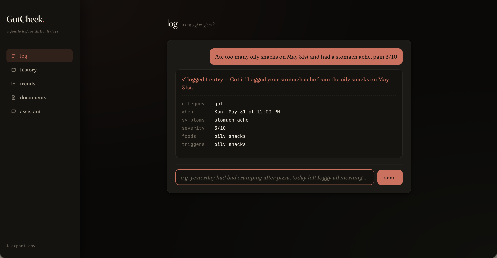
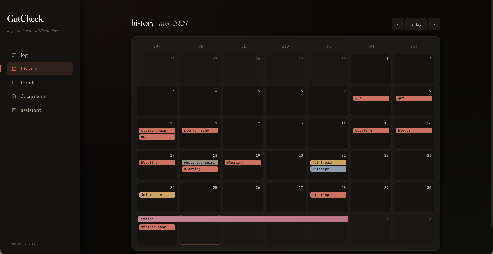
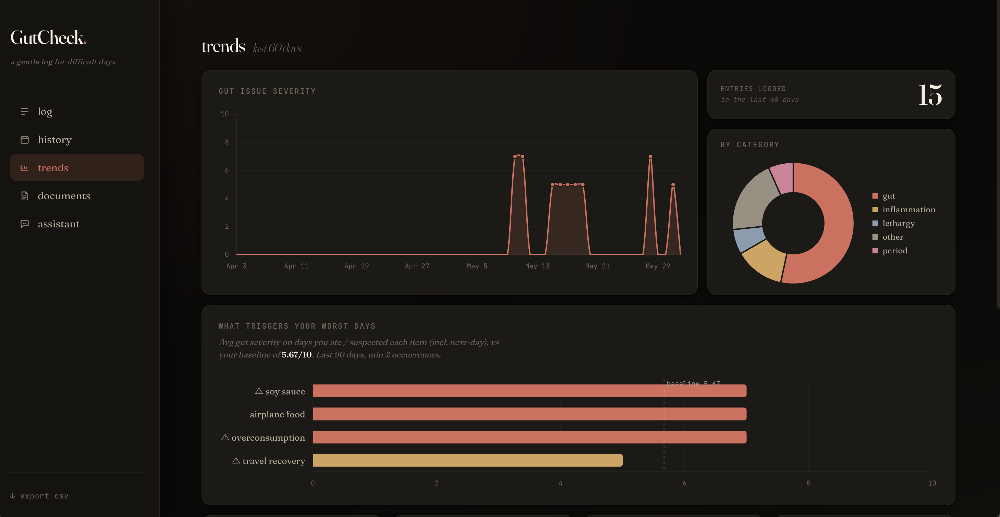
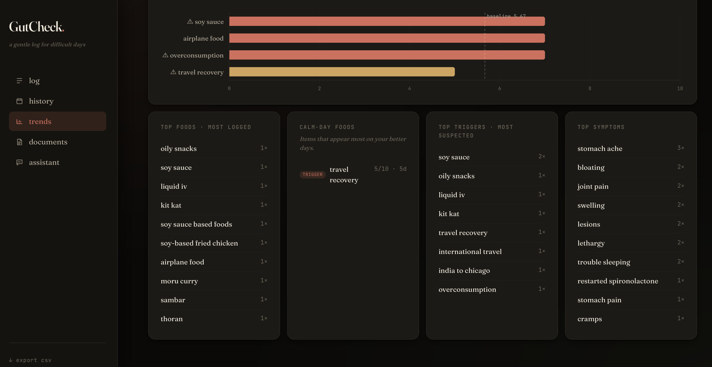
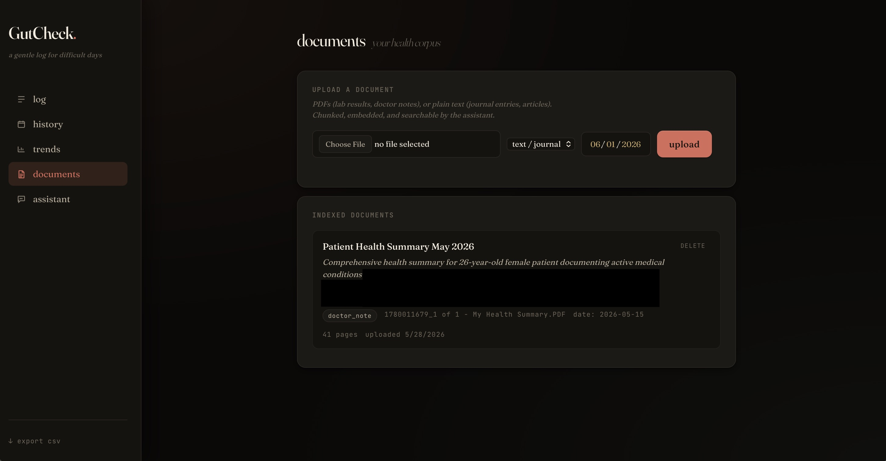
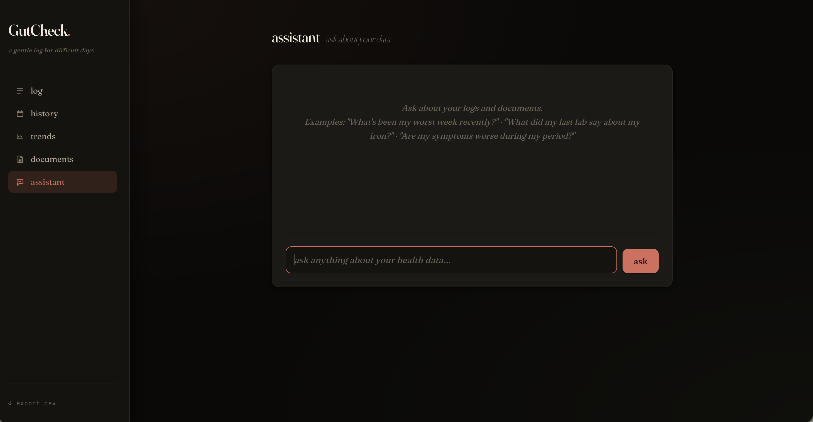

# GutCheck

A personal health intelligence app: log symptoms in plain language, upload your medical documents, and ask a multi-agent system about patterns in your own data.

Built because filling out a form is the last thing you want to do when you feel terrible — and because finding patterns across years of journal entries, lab PDFs, and symptom logs is something a human alone can't realistically do.

> **Not medical advice.** This is a personal logging tool. Talk to a doctor.

---

## Features

### Conversational logging
Type naturally — *"bad cramping after dinner last night, maybe a 7, definitely the pasta"* — and Claude extracts symptoms, severity, category, foods, triggers, and dates. Asks at most one follow-up per turn. Multi-day entries (*"May 20th–22nd — bad stomach ache"*) span correctly on the calendar.

**Weekly food dump** — no time to log daily? Dump the whole week at once: *"this week I had pasta Monday, sushi Wednesday, wine most nights."* Each day gets its own entry with foods populated, no symptoms or severity required.



---

### Calendar view
Month grid with color-coded symptom chips per day. Period bars span their full date range. Click any day for the full detail panel. Edit any entry directly from the calendar — change dates, symptoms, foods, triggers, severity, notes — without re-logging.



---

### Trends
60-day severity chart, food/trigger correlations ranked by average gut severity vs. your personal baseline, category breakdown, top symptoms. Correlations account for same-day and next-day gut response to handle delayed reactions.




---

### Document corpus
Upload PDFs of lab results, doctor notes, journals, or articles. Each document is chunked, embedded with a local model, and stored in SQLite alongside your symptom log. No external embedding API needed.



**How the RAG pipeline works:**
1. On upload, text is extracted (pypdf for PDFs, plain read for text files) and split into overlapping chunks of up to 1,200 characters, preferring paragraph boundaries.
2. Each chunk is embedded using `BAAI/bge-small-en-v1.5` — a 384-dimension model that runs fully locally via [fastembed](https://github.com/qdrant/fastembed), cached after the first download (~130MB). No API key, no usage limits.
3. Embeddings are stored as JSON in SQLite alongside document metadata (filename, source type, date, title, page number).
4. At query time, the question is embedded with the same model and compared against all stored chunks using cosine similarity in NumPy. The top 12 candidates are retrieved.
5. A second LLM pass (claude-haiku-4-5) reranks those 12 down to the 4 most directly relevant passages — filtering out topical-but-not-useful matches.
6. The final passages, with their filename/date/page citations, are handed to the Reflection agent for synthesis.

---

### Multi-agent assistant
Ask questions like *"what are my worst triggers and what has my doctor said about them?"*



The orchestrator (claude-sonnet-4-6) runs a two-phase pattern for every health question:
- **Phase 1 — data:** calls the Analyst agent, which runs a fixed set of SQL analyses over your symptom log (overview, correlations, trend, period overlap). No LLM involved, sandboxed to named analyses so a poisoned document can't instruct it to delete data.
- **Phase 2 — documents:** uses terminology from the data results to form a targeted search query, then runs the Retriever agent over your uploaded documents.

The **Reflection agent** (claude-haiku-4-5) synthesizes both sources into 2–4 sentences with inline citations in `"exact quote" — Source, Date` format.

---

## Architecture

```
Browser (vanilla JS + HTML)
        │
        ▼
FastAPI (app.py)
  ├── /api/log/*          Conversational logging → claude-haiku-4-5
  ├── /api/chat           Agent chat → Orchestrator
  ├── /api/documents/*    Upload → RAG ingest pipeline
  ├── /api/entries/*      CRUD + full edit (PUT)
  ├── /api/periods/*      CRUD
  └── /api/stats          Trend aggregations (pure Python)

Orchestrator (claude-sonnet-4-6, tool-use loop, max 6 iters)
  ├── analyze_data  →  Analyst Agent  (pure Python + SQL, no LLM)
  │                      overview | correlations | trend | period_overlap
  ├── search_documents →  Retriever Agent (claude-haiku-4-5 rerank)
  │                         fastembed BAAI/bge-small-en-v1.5 → cosine sim → top-12
  │                         → LLM rerank → top-4 passages
  └── synthesize_answer →  Reflection Agent (claude-haiku-4-5)
                             data findings + document passages → 2–4 sentence synthesis

SQLite (gutcheck.db) — single file for everything
  ├── sessions / entries / periods   (symptom log)
  └── documents / chunks             (RAG corpus: text + 384-d embeddings as JSON)
```

---

## Models used

| Where | Model | Why |
|---|---|---|
| Orchestrator | `claude-sonnet-4-6` | Tool-use routing, multi-step reasoning |
| Logging extraction | `claude-haiku-4-5` | Structured JSON extraction, fast |
| Document summarization | `claude-haiku-4-5` | Title + one-line summary on ingest |
| Retriever rerank | `claude-haiku-4-5` | Pick top-4 from 12 candidates |
| Reflection / synthesis | `claude-haiku-4-5` | Final answer, inline citations |
| Embeddings | `BAAI/bge-small-en-v1.5` | Local via fastembed, no API key, ~130MB |

---

## Setup

```bash
git clone <repo> gutcheck && cd gutcheck
python3 -m venv .venv && source .venv/bin/activate
pip install -r requirements.txt

cp .env.example .env
# Add your Anthropic API key: https://console.anthropic.com

uvicorn app:app --reload
```

Open [http://localhost:8000](http://localhost:8000).

First document upload downloads the embedding model (~130MB) to `~/.cache/huggingface/` and caches it for all future runs.

---

## Project layout

```
GutCheck/
├── app.py                  # FastAPI app, logging flow, all REST endpoints
├── agents/
│   ├── orchestrator.py     # Tool-use routing loop (Sonnet)
│   ├── retriever.py        # Semantic search + LLM rerank (Haiku)
│   ├── analyst.py          # Fixed-set SQL analyses, no LLM
│   └── reflection.py       # Synthesis with inline citations (Haiku)
├── rag/
│   ├── ingest.py           # PDF/text extraction, LLM summary, page tracking
│   └── store.py            # Chunking, local embeddings, cosine search
├── static/index.html       # Single-page UI (no build step)
├── photos/                 # Screenshots for README
├── requirements.txt
├── .env.example
└── uploads/                # Original uploaded files (gitignored)
```

---

## License

MIT
